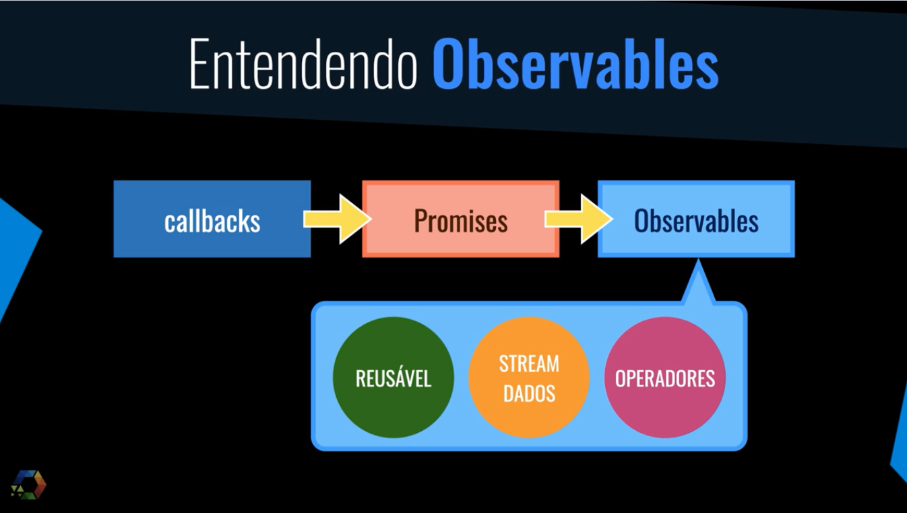
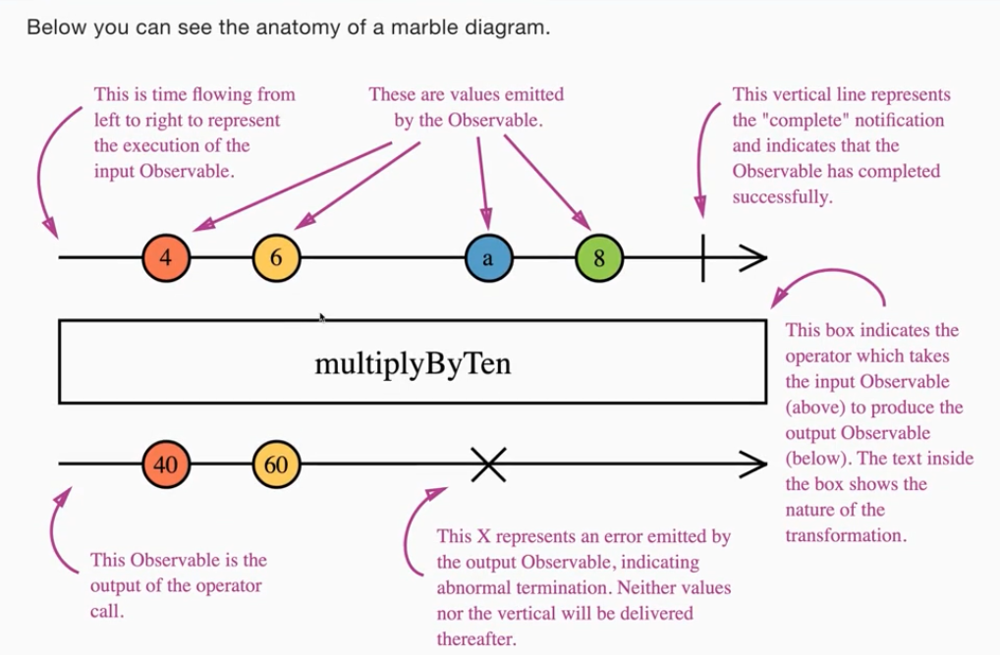
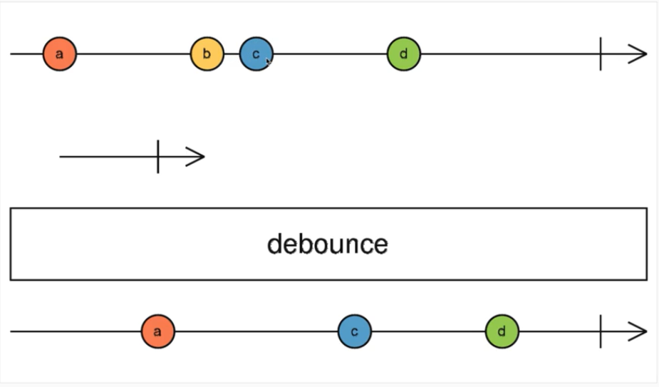
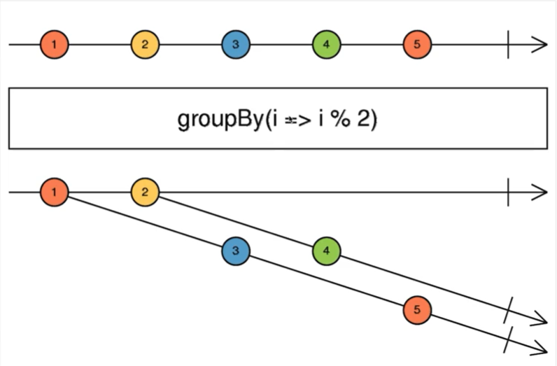
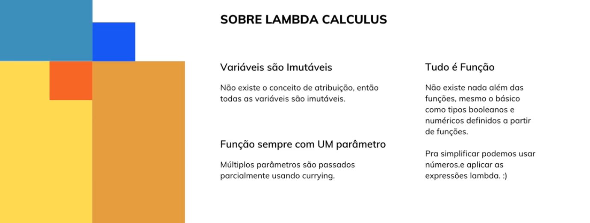
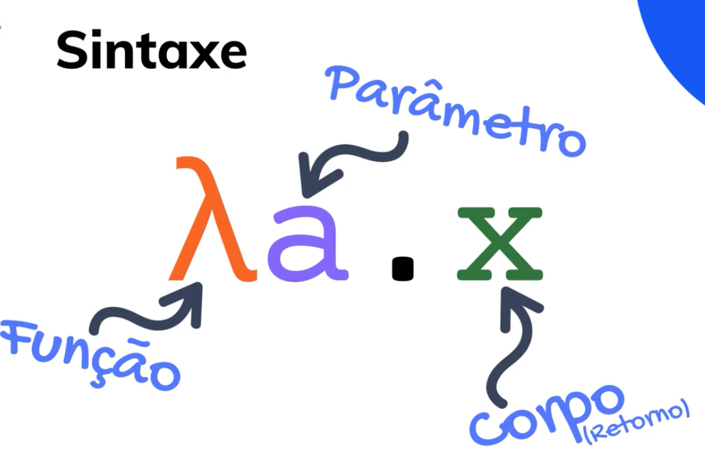
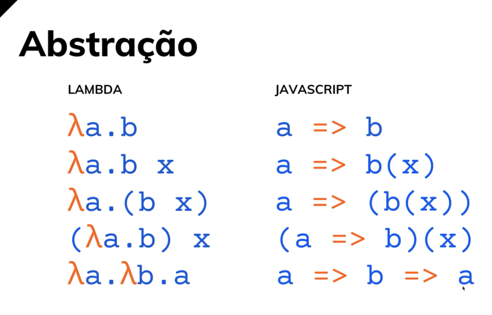
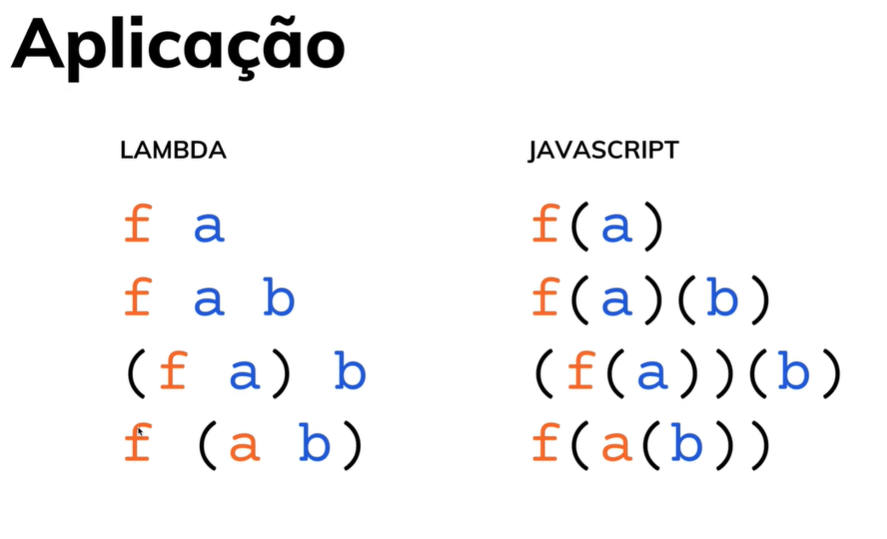
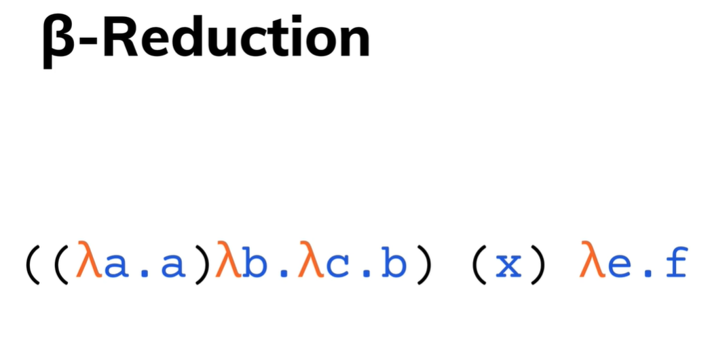

<h1 align="center">
    Javascript Funcional e Reativo
</h1>

  
  
  

  <a href="#sobre">Sobre</a>&nbsp;&nbsp;&nbsp;|&nbsp;&nbsp;&nbsp;
  <a href="#tecnologias-utilizadas">Tecnologias</a>&nbsp;&nbsp;&nbsp;|&nbsp;&nbsp;&nbsp;
  <a href="#pre-requisitos">Pré-requisitos</a>&nbsp;&nbsp;&nbsp;|&nbsp;&nbsp;&nbsp;
  <a href="#license">Licença</a>

## :bookmark: Sobre

Repositório contendo exercícios/projetos utilizando programação funcional com Javascript.

## :rocket: Tecnologias Utilizadas

- [Javascript](https://developer.mozilla.org/pt-BR/docs/Web/JavaScript)
- [RxJS](https://www.learnrxjs.io/)

## :iphone: Screens

<h1 align="center">
    
    
    
    
    
    
    
    
    
</h1>

## :fire: Pré-requisitos

- [NodeJS](https://nodejs.org/)

## :mortar_board: Quem ministrou?

As aulas foram ministradas por **[Leonardo Leitão](https://www.linkedin.com/in/leonardo-leit%C3%A3o-8a5813186/)** no curso **[JavaScript Funcional e Reativo - PENSE como um Desenvolvedor JavaScript [2020]](https://www.cod3r.com.br/courses/javascript-funcional-reativo?ref=8796d8)**.

## :memo: License

Esse projeto está sob a licença MIT. Veja o arquivo [LICENSE](LICENSE) para mais detalhes.

---

<h4 align="center">
    Feito com 💙 by <a
      href="https://www.linkedin.com/in/gustavodomingueti/"
      target="_blank"
    >Gustavo Domingueti</a>
</h4>
